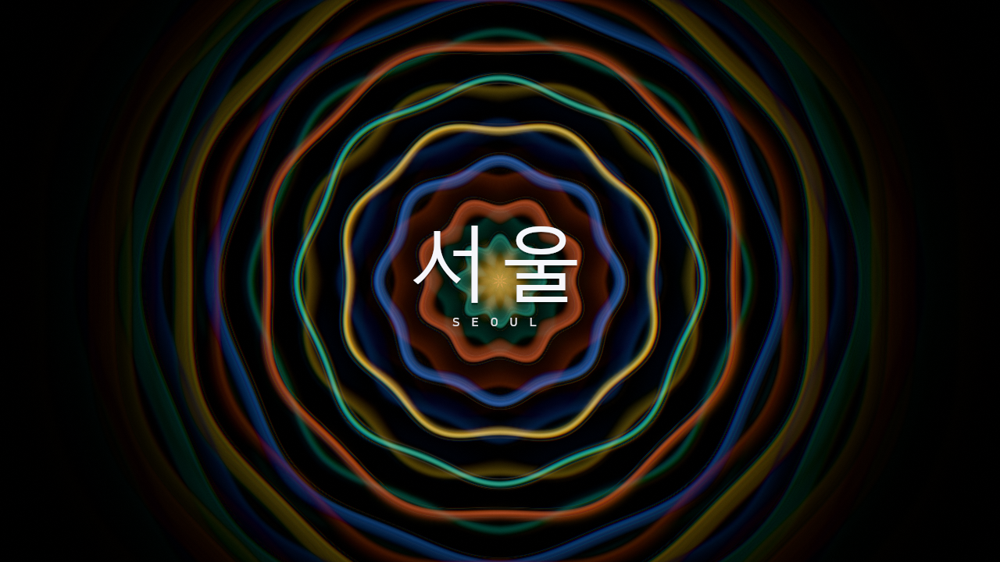

# Seoul · 서울



A real-time music visualizer in the MilkDrop tradition, written in Rust.
Seoul captures whatever your desktop is playing, turns it into bands, beats,
tempo and spectrum, and feeds that to shader visuals. Each frame is drawn
over a warped, fading copy of the frame before it, so the image builds trails
and keeps moving.

**[Download for Windows](https://github.com/chrischaps/Seoul/releases/latest)** ·
[Project page](https://chaps.dev/projects/seoul)

## Running it

Unzip the release, play some music, and run `seoul.exe`. Keep the `presets`
folder beside the exe. The exe isn't code-signed, so Windows SmartScreen may
warn the first time: choose **More info → Run anyway**.

| Key | |
|---|---|
| Space / Backspace | next / previous preset |
| R · A · L | shuffle · auto-advance · lock |
| F · 1–9 · X | favorite · jump to favorite · hide |
| H · F1 · P | help · stats · screenshot |
| F11 · Esc | fullscreen · quit |

`seoul.exe --synth` plays a built-in 124 BPM test track. Use it when nothing
else is playing. `--help` lists all the options. Settings live in
`seoul.toml` and apply while Seoul is running.

## Building from source

```bash
cargo run --release               # debug builds are too slow for 60 fps
cargo test
.\packaging\package.ps1           # → dist\seoul-<version>-windows-x64.zip
```

Seoul is Windows-only. It captures audio through WASAPI loopback and loads
its HUD fonts from `C:\Windows\Fonts`.

## Presets

A preset is a TOML file plus one or two WGSL functions. The TOML holds motion
expressions driven by the audio (`zoom = "1.0 + bass * 0.012"`), a palette
and a look. The WGSL draws each frame and can also warp the previous one.
Saving either file while Seoul is running reloads it right away. A broken
shader shows its error on screen with the file and line, and the music keeps
playing. See **[docs/PRESETS.md](docs/PRESETS.md)** for the authoring guide.

## How it works

Seoul runs three threads. The audio callback fills a ring buffer. An analysis
thread runs an FFT every 256 samples and writes the results to a triple
buffer. The render thread runs the pass chain:

**warp → particles → composite → bloom → post → HUD**

It renders over a pair of `Rgba16Float` feedback textures. Transitions between
presets are per-pixel masks stored in the feedback alpha channel, so a
dissolve, a radial wipe or a clock sweep never touches preset code.
**[docs/ARCHITECTURE.md](docs/ARCHITECTURE.md)** has the full story.
